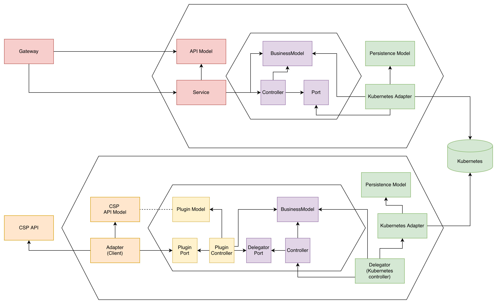
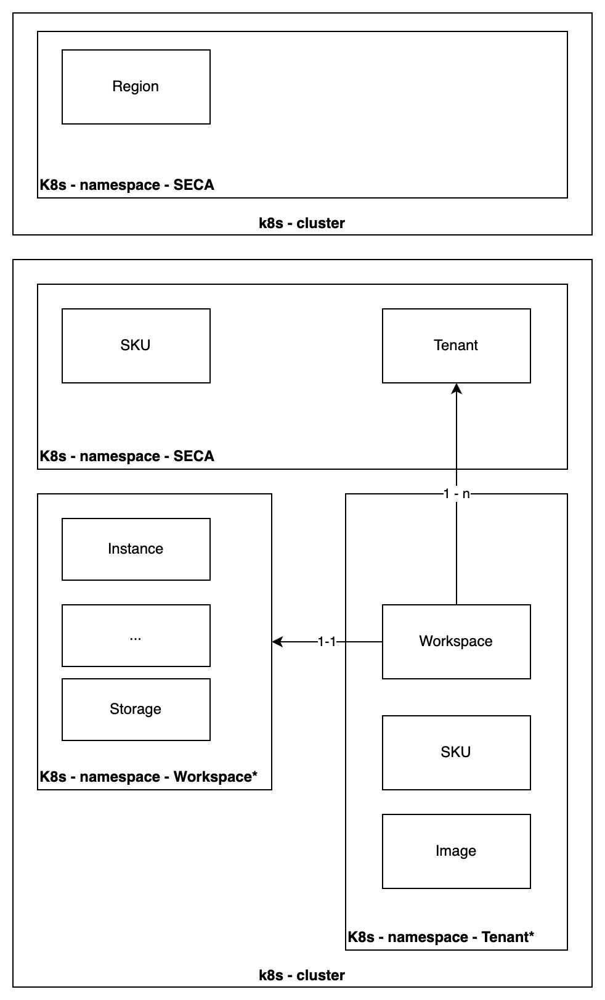

# ECP Architecture

This document describes the design and implementation of the ECP (European Control Plane).

## Overview

The ECP is a distributed control plane for managing and orchestrating cloud resources across multiple cloud service providers (CSPs). It exposes a unified, declarative REST API; all managed resources are persisted as Kubernetes Custom Resources (CRs), providing compatibility with existing Kubernetes tooling and GitOps workflows.

The system has three main layers:

1. **Gateway** — REST API servers (global and regional) generated from the same OpenAPI specs as the client SDK ([go-sdk](https://github.com/eu-sovereign-cloud/go-sdk)), ensuring no encoding gap between client and server.
2. **Delegator** — Kubernetes controllers that watch CRs, validate state transitions, and delegate provisioning to CSP plugins.
3. **Plugins** — CSP-specific adapters that perform the actual resource provisioning (IONOS, Aruba, dummy).

## System Topology

Global and regional resources reside in separate Kubernetes clusters. For simplicity (e.g., local testing) both can be deployed to a single cluster.

## Hexagonal Architecture

ECP follows the hexagonal architecture (ports and adapters) pattern. Two application domains are involved, each implemented as a hexagon:

**Gateway domain**
- Inbound port: REST API (generated from OpenAPI spec)
- Outbound port: K8s repository interface (abstracts client-go)

**Delegator domain**
- Inbound port: Kubernetes watch/reconcile loop
- Outbound port: Plugin interface (CSP-agnostic provisioning contract)

Because both persistence and the plugin backend sit behind interfaces, either can be swapped without touching domain logic.

## Layers

### API Layer (Gateway)

Two HTTP servers expose the ECP REST API:

| Server   | Default port | Scope                                    |
|----------|--------------|------------------------------------------|
| Global   | 8080         | `GET /regions`, `GET /regions/{id}`      |
| Regional | 8080         | `GET/POST /workspaces`, `GET/POST /block-storages`, `GET /skus` |

Both servers are generated from the OpenAPI specification shared with the [go-sdk](https://github.com/eu-sovereign-cloud/go-sdk) client library, so there is no encoding gap between client and server. Incoming requests are written directly to the Kubernetes API server as CR create/update operations.

### Controller Layer (Delegator)

Kubernetes controllers watch CRs and apply the business logic:

- Validate state transitions at admission time.
- Delegate actual provisioning to the CSP plugin via a defined interface.
- The controller layer is fully decoupled from any specific CSP implementation.

### Plugin Layer

Each CSP plugin implements the delegator's plugin interface:

- **IONOS plugin** (`foundation/plugin/ionos/`) — uses Crossplane with `provider-upjet-ionoscloud`.
- **Aruba plugin** (`foundation/plugin/aruba/`) — direct CSP adapter.
- **Dummy plugin** (`foundation/plugin/dummy/`) — reference implementation; logs operations without real provisioning, used for integration testing.

A plugin may introduce its own internal controller layer when the CSP's resource model differs from ECP's.

### Persistence Layer

All resources are persisted as Kubernetes Custom Resources:

- CRD definitions are generated by [controller-gen](https://github.com/kubernetes-sigs/controller-tools) from Go struct annotations.
- API types are generated from the shared OpenAPI spec.
- A repository interface abstracts Kubernetes client-go, making the persistence layer replaceable.

See [CODEGEN.md](CODEGEN.md) for details on the generation pipeline.

## Resource Model

### Global Resources

| Resource | Description |
|----------|-------------|
| `Region` | Available regions (read-only) |

Global resources are stored in the `seca` namespace. Replicating the `seca` namespace between clusters is sufficient to propagate global data.

### Regional Resources

| Resource | Description |
|----------|-------------|
| `Tenant` | Lifecycle owner for all regional resources belonging to one tenant |
| `Workspace` | Logical grouping of resources within a tenant |
| `BlockStorage` | Block storage volume |
| `Network` | Network resource |
| `StorageSKU` / `NetworkSKU` | Available SKU options (read-only) |

### Namespacing Strategy

All resources are namespaced:

- The `seca` namespace groups global and shared resources.
- Each `Tenant` CR triggers the creation of a dedicated tenant namespace; all regional resources owned by that tenant live there.
- `Workspace` CRs are placed in the tenant namespace and labeled with their parent tenant.

This design keeps tenant isolation at the namespace level and simplifies cross-cluster replication (replicate the `seca` namespace for global data).

## Cascaded Deletion

ECP enforces owner-reference–based cascaded deletion:

- Deleting a **Tenant** cascades to all its Workspaces and all resources within them.
- Deleting a **Workspace** cascades to all resources within that workspace.

This ensures resources are properly cleaned up when their parent entities are removed.
