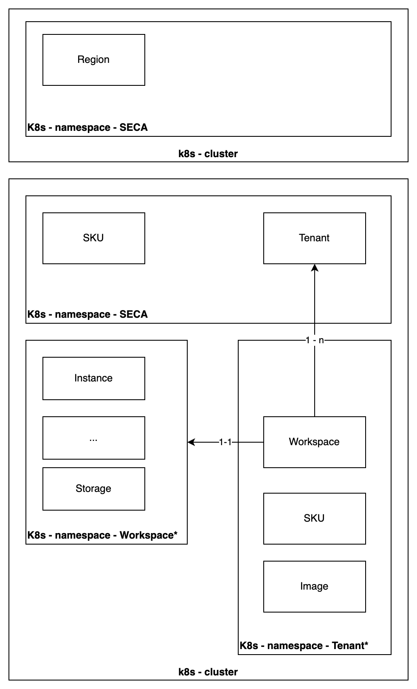
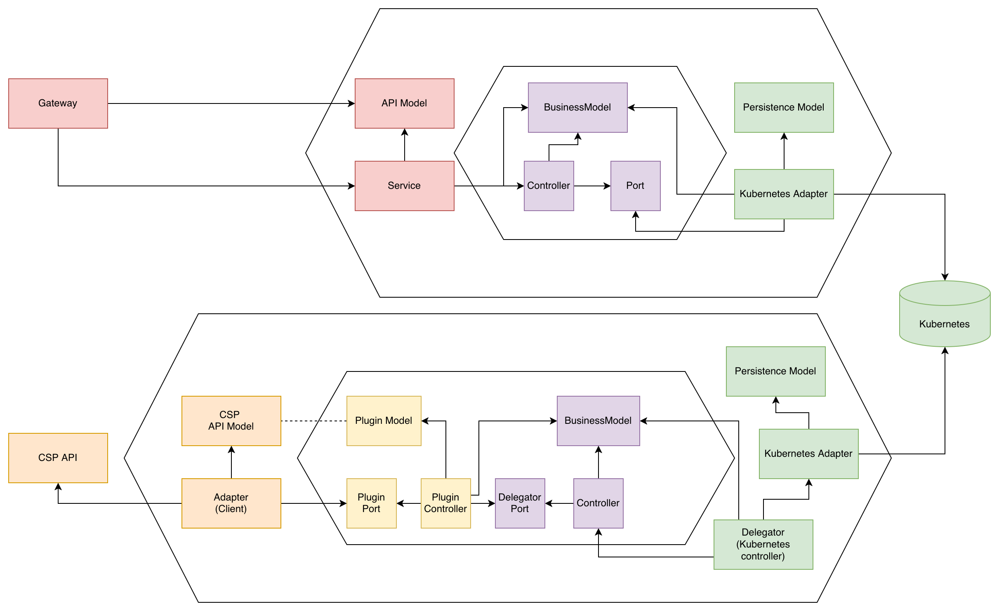

# ECP Documentation

This document provides comprehensive documentation on the design and implementation of the ECP (European Control Plane).

## Overview

The ECP (European Control Plane) is a distributed control plane architecture designed to manage and orchestrate resources across multiple cloud service providers within a single provider scope.

The architecture leverages Kubernetes extensibility by representing all managed resources as Kubernetes Custom Resources (CRs). This approach provides a unified, declarative interface for resource management while maintaining compatibility with existing Kubernetes tooling and workflows.

The ECP has multiple layers, the first layer is the API layer that is utilizing the generated code from the [go-sdk](https://github.com/eu-sovereign-cloud/go-sdk) repository to have no gap between the client and server implementation when it comes to encoding the resources.

The second layer are the controllers that apply sensible validation at admission of resources. These controllers process the resources and trigger the plugins provided by the CSP to perform the actual provisioning and management of the resources.

## Resource Relationships

Global and regional resources are assumed to be unique kubernetes clusters, but they can for simplicity (e.g. testing) also be deployed to a single cluster.

All resources are namespaced. The namespace `seca` is used to group all resources related to the ECP. Which are "global" resources. This allows for better reuse of resources (e.g. SKU CR) and simplifies management.

Replicating global data between multiple clusters can thus be simplified by replicating the `seca` namespace between clusters.

### Tenant

Regional resources owned by a tenant are placed in a tenant namespace. The tenant namespace is created when a Tenant CR is created. All regional resources reference the Tenant CR they belong to.

Depending on the CSP the Tenant may be created by "activating SECA" within the systems of the CSP. If the CSP follows a model where all tenants can use the SECA API, the CSP has to create the corresponding Tenant CR when a new tenant managed by the CSP.

The tenant CR is important as it manages the lifecycle of all regional resources. Deleting the Tenant CR will delete all regional resources owned by the tenant.

### Workspace

A workspace CR represents a logical grouping of resources within a tenant. Workspaces can be used to separate environments (e.g., development, staging, production) or projects within a tenant. Each workspace CR is placed
in the tenant namespace and has labels to identify it as belonging to a specific tenant.

The workspace controls the lifecycle of resources within it. Deleting a workspace CR will delete all resources associated with that workspace.

## Cascaded Deletion

Deleting a tenant will cascade delete all workspaces and resources associated with that tenant. Similarly, deleting a workspace will cascade delete all resources within that workspace. This ensures that resources are properly cleaned up when their parent entities are removed.

## Architecture

The general architecture of the ECP consists of the following components follows
the hexagonal architecture pattern. Because the ECP has a plugin-based architecture
and used a gateway and delegator (controller) pattern. Two application domains with
two hexagons are shown in the diagram above.

The Kubernetes persistence layer is abstracted away behind the repository interfaces.
It is therefore replaceable with another persistence layer if needed.

Persistence and API models are generated from the same OpenAPI specification and
from kubernetes CRD definitions.

the Business Logic layer contains the core logic of the ECP. It is responsible for
validating and processing the resources and delegating the actual provisioning and
management of resources to the CSP-specific plugins.

The CSP might have a plugin model that is different from the ECP business model. Therefore another controller layer is introduced.
